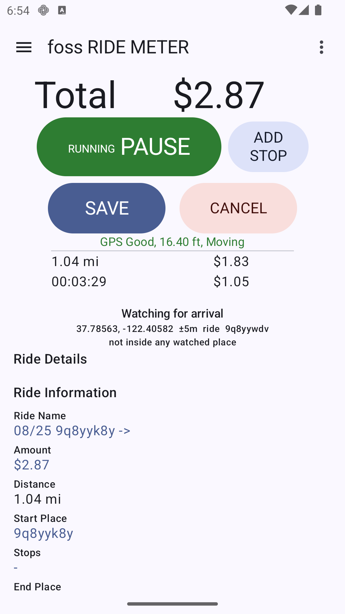
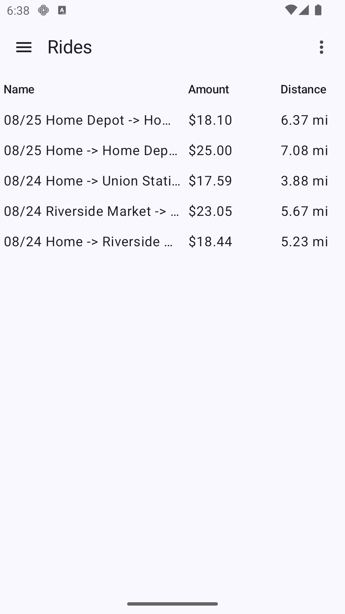
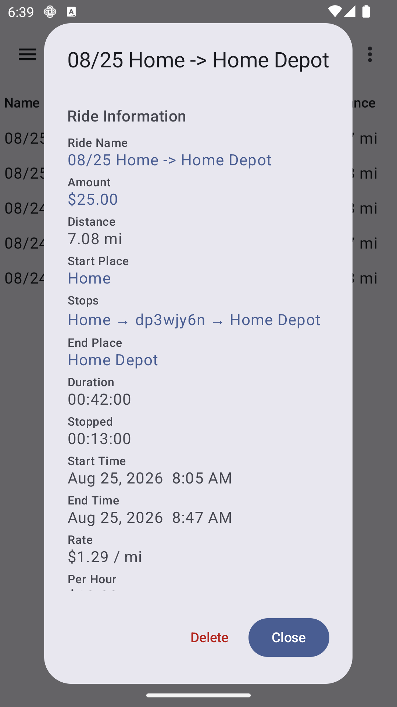
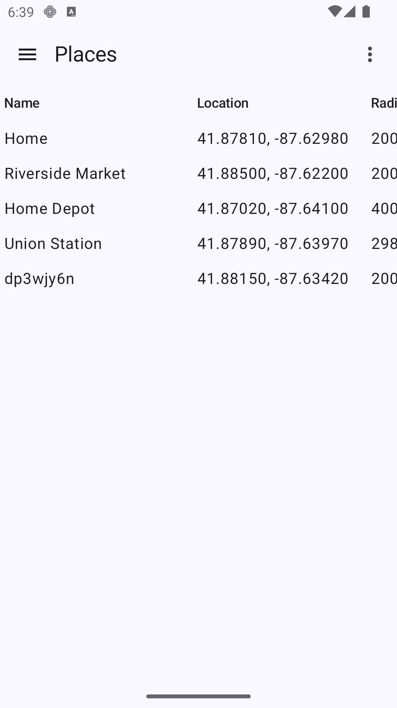
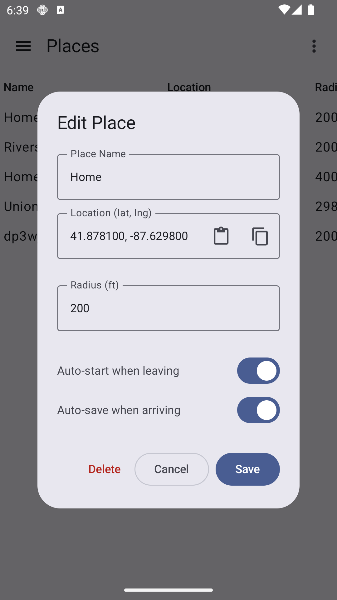
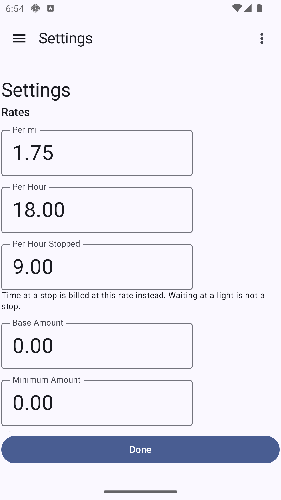

# FossRideMeter

A free, open-source Android ride meter.

FossRideMeter tracks a ride's distance and elapsed time by GPS, computes a
fare-style amount from rates you configure, and saves each completed ride
along with the places it started and ended at and the stops made along the
way.

Everything stays on the device. There is no account and no telemetry — the
app does not hold the `INTERNET` permission, so it cannot open a network
connection at all. Android's own backup service is
switched off too, so ride history is not copied to a cloud backup — which
means a new phone does not get your rides back by itself; export them
first. See [PRIVACY.md](PRIVACY.md) for what is stored where.

**Status: pre-release (`0.1.1`).** Upgrades now migrate the database
rather than rebuilding it, and every upgrade sets a complete copy of the
old database aside first. It is still pre-release: back up what you'd
mind losing, using the JSON export.

## Features

* Live distance, elapsed time, and running amount while driving.
* Tracking continues in the background via a foreground service, with an
  ongoing notification and an optional draggable floating amount bubble.
* Configurable per-distance rate, hourly rate, base amount, and minimum
  amount.
* US (miles/feet) or SI (kilometers/meters) units. Everything is stored in
  SI internally and converted only for display.
* Automatic place detection — rides link to saved places, whose locations
  refine themselves as more rides arrive. Places can be named, given a
  coverage radius, and pinned to exact coordinates.
* Automatic stop detection along a ride, with a configurable dwell time.
* Ride history with full per-ride detail, editable names and amounts.
* Export and import via the Storage Access Framework: rides as JSON,
  places as JSON (import also accepts CSV and GPX).
* A built-in GPS simulator, so the app can be exercised with no location
  hardware. Tracking uses real GPS by default; the simulator is a
  Settings away.

## Screenshots

| Metering a ride | Ride history | A ride's detail |
|---|---|---|
|  |  |  |

| Places | Editing a place | Rates |
|---|---|---|
|  |  |  |

Demo data on an emulator — the rides above were metered by the built-in
simulator, and the coordinates are fictional.

## Requirements

Android 8.0 (API 26) or newer.

Permissions used: location (tracking), notifications (the ongoing ride
notification), display over other apps (the floating bubble), and an
optional battery-optimization exemption so long rides aren't cut short.
Background location is asked for only when you first flag a place to
start or save a ride automatically. Every permission and its reason is
listed in [PRIVACY.md](PRIVACY.md).

## Installing

There is no app store listing. Download the APK from the
[releases page](../../releases), open it, and allow your browser or file
manager to install unknown apps when Android asks.

The APK is signed with a key that does not change between releases, so
later versions install straight over an earlier one and your rides come
with them. Android will refuse the update if you ever sideload a build
signed with a different key — including a debug build from Android
Studio — and the only way past that is uninstalling, which deletes your
rides. Export them first if you are about to try one.

[`docs/quickstart.md`](docs/quickstart.md) walks through the install, the
permissions, and a first ride — including what to do when a permission
toggle will not turn on. It is the same text as the app's own **Help**
screen, so you can read it before installing or after.

On first run the app meters from real GPS. If you want to see how it
behaves without driving anywhere, Settings → Distance Provider →
Simulator plays back a scripted route.

## Building

The project builds from Android Studio with its bundled JBR 21.

From a shell, `JAVA_HOME` must point at a JDK 17+ (Android Studio's
bundled `android-studio/jbr` works) before invoking Gradle:

```bash
./gradlew assembleDebug          # build the debug APK
./gradlew installDebug           # build and install on a connected device
./gradlew lint                   # Android lint
./gradlew test                   # JVM unit tests
```

`compileSdk`/`targetSdk` 37, `minSdk` 26, JVM toolchain 17.

Release signing reads an optional `keystore.properties` in the project
root; it and `local.properties` are local-only and not in version control.

Every `.kt` file carries an SPDX license header. After adding source files,
run `./add_license_headers.sh` — it is idempotent.

## Documentation

* [`docs/quickstart.md`](docs/quickstart.md) — using the app; the same
  text the Help screen shows.
* [`docs/architecture.md`](docs/architecture.md) — how the app is put
  together.
* [`docs/decisions.md`](docs/decisions.md) — why it is put together that
  way.
* [`docs/ui.md`](docs/ui.md) — screens and terminology.
* [`docs/roadmap.md`](docs/roadmap.md) — what is done and what is next.

## License

Copyright (C) 2026 Rick Hallock

FossRideMeter is free software: you can redistribute it and/or modify it
under the terms of the **GNU General Public License v3.0 or later**
(GPL-3.0-or-later) as published by the Free Software Foundation.

FossRideMeter is distributed in the hope that it will be useful, but
WITHOUT ANY WARRANTY; without even the implied warranty of
MERCHANTABILITY or FITNESS FOR A PARTICULAR PURPOSE. See the
[LICENSE](./LICENSE) file for the full text.

SPDX-License-Identifier: `GPL-3.0-or-later`

### Linking exception

As a special exception under GPL v3 section 7, this program may be
combined and distributed with the Google Play services client libraries
(`com.google.android.gms`), which the GPS distance provider uses and
which are proprietary. See [LICENSE-EXCEPTION.txt](./LICENSE-EXCEPTION.txt)
for the full statement.
